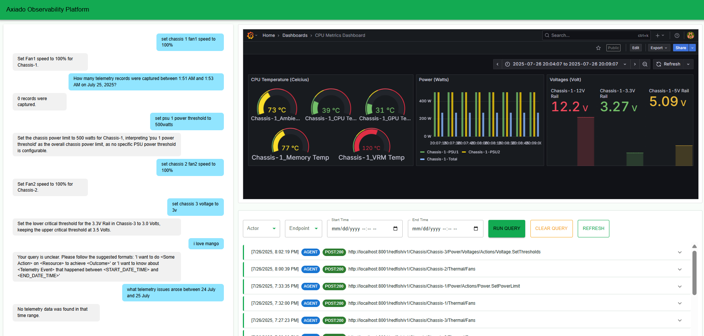
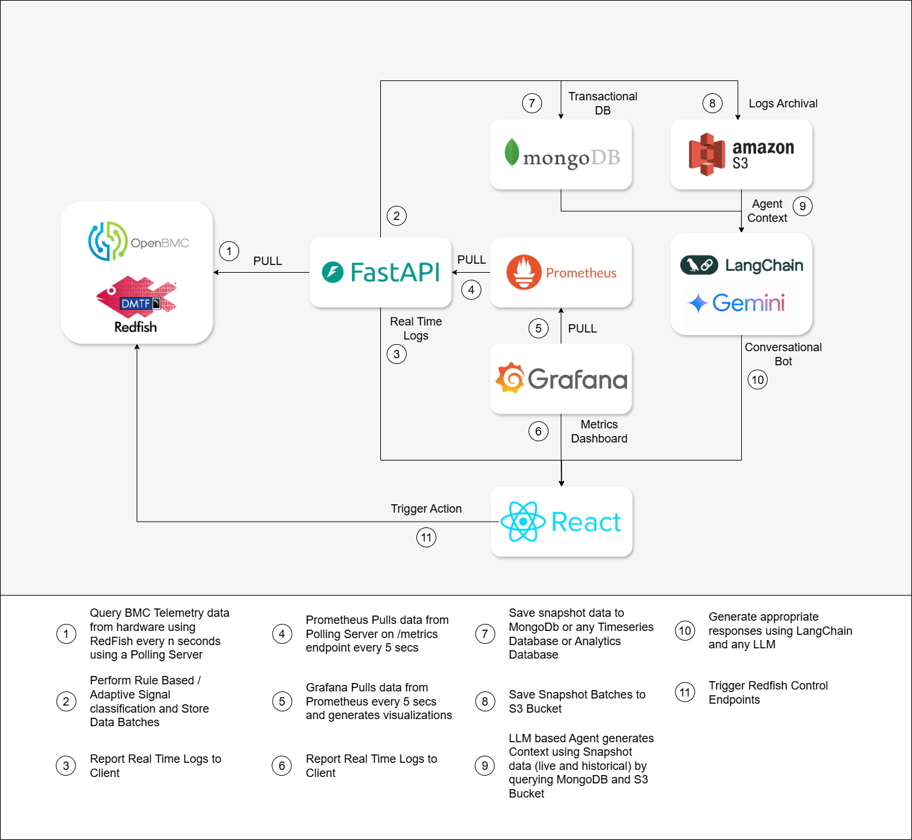

# Agentic AI for Autonomous Infrastructure Observability and Control

### Quick Resources:

[OUTLINE.md](./OUTLINE.md)

[UPDATE.md](./UPDATE.md)

---

## Application View

### **Axiado Observability Platform – Architecture Overview**

The architecture integrates multiple components for **hardware telemetry, real-time observability, AI-driven insights, and automated control actions.** Below is a structured explanation:

---

### **1. Redfish API (Mocked Layer)**

* We have **mocked the Redfish API from scratch** to simulate BMC (Baseboard Management Controller) telemetry.
* It provides hardware metrics (e.g., fan speeds, voltages, power limits) and accepts control commands (e.g., adjusting thresholds or turning on/off components).
* This mock Redfish API acts as the **data source** for telemetry.

---

### **2. FastAPI Backend**

* FastAPI **pulls telemetry data** from the Redfish API at regular intervals (Step 1).
* Implements **rule-based signal classification** and stores data batches (Step 2).
* Streams **real-time logs** to the React UI using SSE (Server-Sent Events) or polling (Step 3).
* Exposes `/metrics` endpoints for Prometheus scraping (Step 4).

---

### **3. Prometheus & Grafana**

* **Prometheus** polls the FastAPI `/metrics` endpoint every 5 seconds (Step 4).
* **Grafana** visualizes Prometheus data in real time and renders dashboards (Step 5 & 6).
* **Real-time Grafana dashboards** are embedded into the React UI for seamless monitoring.

---

### **4. MongoDB & S3**

* **MongoDB** stores transactional/historical telemetry data (Step 7).
* **S3** is used for **log archival and snapshot storage** (Step 8).

---

### **5. LangChain + Gemini AI**

* AI uses **LangChain with Gemini** to query both MongoDB and S3 snapshots (Step 9).
* Supports **two query types**:

  1. **Inference Queries** – e.g., “How many telemetry records were captured between two timestamps?”
  2. **Action Queries** – e.g., “Set chassis fan speed to 100%” or “Adjust PSU power threshold.”
* AI responses are conversational, providing contextual explanations.

---

### **6. React Frontend**

* **Chat panel:** Allows natural language queries (inference & action-based).
* **Real-time logs panel:** Displays logs as they stream from the backend.
* **Grafana panel:** Embedded real-time metrics visualization.
* **Query filters:** Enables historical log search (via MongoDB queries).
* Users can ask:

  * *“What telemetry issues arose between July 24 and July 25?”* (inference)
  * *“Set PSU 1 power threshold to 500 watts.”* (action → triggers Redfish endpoints).

---

### **7. Trigger Actions**

* AI can **trigger Redfish control endpoints** through FastAPI (Step 11).
* Example: Adjusting fan speeds, changing voltage thresholds, or power limits.

---

### **Key Highlights**

* **Fully mocked Redfish API** with both telemetry and control.
* **Real-time logs + AI-based conversational interface.**
* **Two types of queries:**

  * Historical data inference from MongoDB/S3.
  * Hardware control via Redfish actions.
* **Prometheus & Grafana embedded in the same React screen** for a unified observability dashboard.

---

### **Future Scope**

1. **Real Hardware Integration**

   * Replace the mocked Redfish API with a **real Redfish + BMC stack**, enabling **vendor-specific control actions** (e.g., power capping, thermal throttling, fan tuning).

2. **Scalable Log Streaming**

   * Introduce **Kafka** (or a Kafka-compatible queue) for distributed log streaming and reliable ingestion, making the system horizontally scalable.

3. **Containerization & Deployment**

   * **Dockerize and containerize** the entire platform and deploy on Kubernetes for fault tolerance and ease of scaling.

4. **Batch & Stream Aggregation**

   * Integrate **Apache Flink** and **Apache Spark** for both **batch and stream processing** of logs and telemetry data, enabling advanced analytics like trend detection and rolling aggregations.

5. **Online Log Querying**

   * Add **real-time querying capabilities via Flink SQL**, integrated directly into the UI for instant, complex queries over streaming logs.

6. **Adaptive Control & Autonomous Agents**

   * While the current setup performs **batch archival**, we will extend it with an **LLM-based agent** that monitors logs, detects anomalies, and **autonomously triggers corrective actions** or **sends alerts**.

---

## Meet The Team:

### **Aditya Dawadikar**
[LinkedIn](https://linkedin.com/in/aditya-dawadikar) | [Website](https://portfolio-aditya-dawadikar.vercel.app/) | [GitHub](https://github.com/aditya-dawadikar) | [Medium](https://medium.com/@aditya-dawadikar)

### **Udayan Atreya**
[LinkedIn](https://www.linkedin.com/in/uatreya/) | [Website](https://udayan-atreya.netlify.app/) | [GitHub](https://github.com/slowloris-98)

### **Sohan Vallapureddy**
[LinkedIn](https://www.linkedin.com/in/vallapureddy-sohan/) | [Website](https://sohanv.com/) | [GitHub](https://github.com/sohan2000)

### **Harshavardhan Valmiki**
[LinkedIn](https://www.linkedin.com/in/harshavalmiki/) | [GitHub](https://github.com/Harshavalmiki)

---
